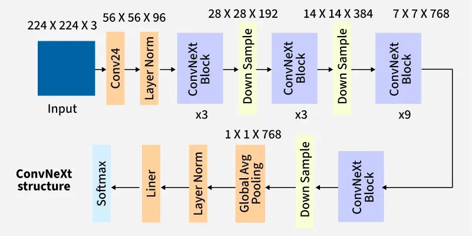

# ConvNeXt for Alzheimer's Disease Classification

## Problem Description

Alzheimer's disease (AD) is a progressive neurodegenerative disorder and the most common cause of dementia worldwide. Early and accurate diagnosis is crucial for treatment planning and patient care. This project tackles the challenge of automatically distinguishing between Alzheimer's disease (AD) patients and cognitively normal (NC) individuals using brain MRI scans from the ADNI (Alzheimer's Disease Neuroimaging Initiative) dataset.

## Algorithm Overview

This implementation uses ConvNeXt-Small, a modern convolutional neural network architecture introduced by Liu et al. in 2022. Think of ConvNeXt as a refreshed version of classic convolutional networks that incorporates lessons learned from Vision Transformers while keeping things efficient and straightforward. The model takes grayscale brain MRI slices, converts them to 3-channel images (to work with ImageNet-pretrained weights), and learns to identify patterns that distinguish AD from normal brains.

The training process involves several data augmentation techniques such as, random crops, horizontal flips, affine transformations, and color jittering to help the model generalize better. We use cross-entropy loss with the AdamW optimizer to train the network, and the final output is a binary prediction: AD or NC.

## Model Architecture



*Figure: ConvNeXt architecture showing the progression from input through convolutional stem, multiple ConvNeXt blocks with downsampling stages, global average pooling, and final classification head.*

### Architecture Details

The ConvNeXt-Small architecture consists of several key components that work together to extract meaningful features from brain MRI images:

**1. Input Processing:** The network accepts 224×224×3 images. Our grayscale brain MRI slices are replicated across three channels to leverage ImageNet-pretrained weights.

**2. Stem Layer:** A 4×4 convolutional layer with stride 4 (acting as "patchify") reduces the spatial dimensions from 224×224 to 56×56 while expanding channels to 96. This is followed by LayerNorm.

**3. Four Hierarchical Stages:** The backbone consists of four stages with depths [3, 3, 27, 3] blocks and channel dimensions [96, 192, 384, 768]:
   - Each stage processes features at different spatial resolutions (56×56, 28×28, 14×14, 7×7)
   - Between stages, downsampling layers use 2×2 convolutions with stride 2 to reduce spatial dimensions while doubling channels

**4. ConvNeXt Blocks:** Each block includes:
   - 7×7 depthwise convolution for spatial feature extraction
   - LayerNorm2d for normalization across the channel dimension
   - Two 1×1 pointwise convolutions (expansion to 4× channels, then projection back) with GELU activation
   - Layer scaling with learnable parameters initialized to 1e-6
   - Stochastic depth (DropPath) for regularization, with rates linearly increasing from 0 to 0.2 across all 36 blocks

**5. Classification Head:** 
   - Global average pooling reduces 7×7×768 features to 768-dimensional vectors
   - LayerNorm normalizes the features
   - Dropout (p=0.3) for regularization
   - Final linear layer projects to 2 classes (AD vs NC)

This architecture allows the network to learn hierarchical representations, from low-level edges and textures in early stages to high-level semantic patterns associated with Alzheimer's disease in deeper stages.

## Project Structure
```
.
├── dataset.py          # Data loading and preprocessing utilities
├── modules.py          # ConvNeXt model architecture implementation
├── train.py            # Training, validation, and testing script
├── predict.py          # Inference script for making predictions
├── asstes/             # Directory containing visualizations
└── README.md           # This file
```

## References

GeeksforGeeks. (n.d.). *ConvNeXt*. https://www.geeksforgeeks.org/computer-vision/convnext/

Liu, Z., Mao, H., Wu, C.-Y., Feichtenhofer, C., Darrell, T., & Xie, S. (2022). A ConvNet for the 2020s. *arXiv*. https://arxiv.org/abs/2201.03545