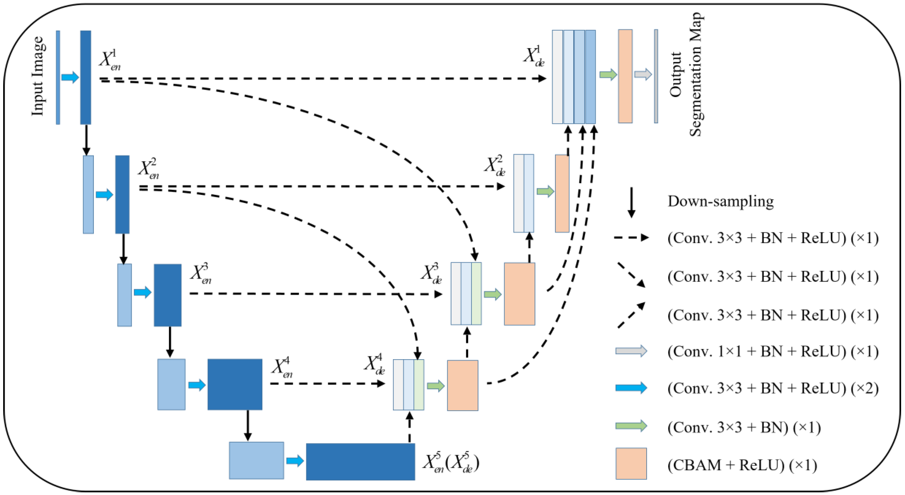

# Improved U-Net for OASIS Brain Segmentation

## Problem Description

Brain structure segmentation from MRI scans is a fundamental task in neuroimaging research and clinical diagnosis. Accurate delineation of brain tissues is essential for studying neurological disorders, tracking disease progression, and planning treatment interventions. This project tackles the automated multi-class segmentation of brain MRI slices from the OASIS dataset, which contains structural brain scans from individuals across different age groups and cognitive states. Manual segmentation is extremely time-consuming and very variative between indivduals, which makes automated approaches incredibly valuable for large-scale neuroimaging studies. 

## Algorithm Overview

This implementation uses an Improved U-Net architecture, which takes the classic U-Net design and enhances it with several modern techniques to boost segmentation performance. Think of the core U-Net as having two main pathways: an encoder that compresses the image while extracting important features, and a decoder that reconstructs the full-resolution segmentation. What makes this version "improved" are the additions of residual connections (allowing gradients to flow more easily during training), squeeze-and-excitation blocks for channel attention (helping the network focus on important features), and gated attention mechanisms on skip connections (selectively emphasizing relevant information while filtering out noise). The encoder progressively downsamples through four stages, learning increasingly abstract representations, while the decoder mirrors this process to produce the final segmentation.

The training approach starts with grayscale brain MRI slices at 256×256 resolution. I preprocess the data with intensity normalization and apply augmentation techniques like random rotations, flips, and intensity adjustments—all while keeping the image and mask perfectly aligned. Each residual block uses grouped normalization and includes squeeze-and-excitation modules that let the network dynamically adjust the importance of different feature channels. I also use deep supervision by adding extra segmentation outputs at intermediate decoder stages, which helps guide learning throughout the network rather than just at the end.

## Model Architecture



*Figure: Improved U-Net architecture showing the encoder pathway (left, blue blocks) progressively downsampling through four stages, a bottleneck with residual connections, and the decoder pathway (right, orange blocks) with attention-gated skip connections (dashed arrows) that merge encoder features with upsampled decoder features. Each block incorporates residual connections, group normalization, and channel attention mechanisms. Deep supervision outputs are generated at multiple decoder scales (green arrows).*

### Architecture Details

The Improved U-Net architecture consists of several sophisticated components working together to achieve precise brain tissue segmentation:

**1. Input Processing:** The network accepts 256×256 single-channel grayscale MRI slices. Images are normalized with zero mean and unit standard deviation to stabilize training and improve convergence.

**2. Encoder Pathway:** Four downsampling stages with progressively increasing channels [32, 64, 128, 256]:
   - Each stage uses a `ResidualConvBlock` with double 3×3 convolutions, group normalization, and a residual shortcut
   - Squeeze-and-excitation blocks recalibrate channel responses based on global context
   - Strided 3×3 convolutions (stride=2) perform spatial downsampling between stages
   - Spatial resolutions: 256×256 → 128×128 → 64×64 → 32×32 → 16×16

**3. Bottleneck:** A residual block at 512 channels maintains a large receptive field without further downsampling, capturing high-level semantic information about brain anatomy.

**4. Decoder Pathway:** Four upsampling stages mirroring the encoder [256, 128, 64, 32]:
   - Transposed convolutions (stride=2) upsample feature maps to higher resolutions
   - `GatedSkipConnection` (attention gates) modulate encoder features before concatenation
   - Each decoder block fuses upsampled features with gated skip connections
   - Bilinear interpolation handles any spatial misalignment

**5. Attention Gates:** Learn to suppress irrelevant regions and highlight tissue boundaries:
   - Combine encoder skip features with decoder context through 1×1 convolutions
   - Generate spatial attention maps via sigmoid activation
   - Element-wise multiplication applies the learned gates to skip connections

**6. Deep Supervision:** Auxiliary segmentation heads at each decoder stage:
   - 1×1 convolutions produce class predictions at multiple scales
   - All outputs upsampled to input resolution for joint supervision
   - Encourages intermediate layers to learn meaningful representations

**7. Final Classifier:** A 1×1 convolution projects the final decoder features to 4 class channels (background, gray matter, white matter, CSF), followed by softmax for probability maps.

This architecture enables the network to learn hierarchical representations, from low-level edges and intensity patterns in early stages to high-level anatomical structures in deeper stages, while attention mechanisms ensure focus on diagnostically relevant tissue boundaries.

## Project Structure
```
.
├── dataset.py          # OASIS dataset loader with augmentation
├── modules.py          # Improved U-Net architecture implementation
├── train.py            # Training script with validation and testing
├── predict.py          # Inference script for visualization
├── assets/             # Directory containing visualizations
└── README.md           # This file
```

## References

Xu, Y., Hou, S., Wang, X., Li, D., & Lu, L. (2023). A Medical Image Segmentation Method Based on Improved UNet 3+ Network. *Diagnostics*, *13*(3), 576. https://doi.org/10.3390/diagnostics13030576